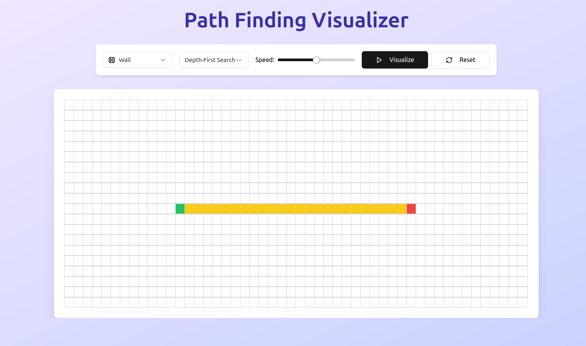

# 🗺️ Pathfinding Visualizer

An interactive pathfinding visualizer built using **React (Next.js with TypeScript)** and **Framer Motion**. It allows users to visualize pathfinding algorithms like **Dijkstra's, A\***, **BFS**, and **DFS** on a grid.
[](https://pathfinding-visualizer-xi-nine.vercel.app/)

[Live Demo](https://pathfinding-visualizer-xi-nine.vercel.app/)

## 🚀 Features

- 🎨 **Interactive UI** - Click and drag to place walls, start, and end points.
- 🔍 **Pathfinding Algorithms**
  - **Dijkstra's Algorithm** 🏁 (Weighted, guarantees shortest path)
  - **A\*** ⭐ (Uses a heuristic for optimized pathfinding)
  - **BFS (Breadth-First Search)** 🔄 (Unweighted, guarantees shortest path)
  - **DFS (Depth-First Search)** 🔍 (Unweighted, does not guarantee shortest path)
- 🔥 **Animated Search Process** - Nodes turn blue as they are explored.
- ✨ **Final Path Highlighting** - The shortest path is highlighted in **yellow**.
- 📏 **Adjustable Speed** - Control the animation speed.
- 📱 **Responsive Design** - Works on mobile and desktop.

## 🛠️ Tech Stack

- **Frontend**: React (Next.js) with TypeScript
- **UI Components**: Tailwind CSS + Lucide Icons + Framer Motion
- **State Management**: React Hooks (`useState`, `useEffect`, `useCallback`)

## Setup & Installation

### Clone the Repository

```sh
git clone https://github.com/itssodope01/Pathfinding-Visualizer.git
cd Pathfinding-Visualizer
```

### Install Dependencies

```sh
npm install  # or yarn install
```

### Run the Development Server

```sh
npm run dev  # or yarn dev
```

Your app should now be running at `http://localhost:3000`.

## 🎮 How to Use

1. **Select a Mode**

   - 🏁 **Start Point**: Click to place the start node.
   - 🚩 **End Point**: Click to place the target node.
   - 🧱 **Walls**: Click and drag to draw obstacles.

2. **Choose an Algorithm**

   - `Dijkstra's` → Best for weighted graphs (guarantees shortest path).
   - `A*` → Fastest, uses heuristics.
   - `BFS` → Works for unweighted graphs.
   - `DFS` → Not optimal but explores deep paths first.

3. **Adjust Speed** 🏃

   - Use the slider to slow down or speed up the animation.

4. **Click "Visualize"** 🎬

   - Watch the algorithm search for the shortest path.

5. **Reset** 🔄
   - Click reset to clear the grid.

## 🧠 Algorithms Explained

### **1️⃣ Dijkstra’s Algorithm (📏 Guaranteed Shortest Path)**

- Works on **weighted graphs**.
- Always finds the **shortest path**.
- Explores **all possible paths** before selecting the best one.
- Complexity: **O((V + E) log V)** using a priority queue.

### **2️⃣ A\* Search (🚀 Fastest)**

- Uses **g(n) + h(n)** where:
  - `g(n)`: Cost from the start node.
  - `h(n)`: Heuristic (Manhattan Distance).
- Focuses on promising paths first.
- Complexity: **O((V + E) log V)**.

### **3️⃣ Breadth-First Search (BFS) (🔄 Best for Unweighted Graphs)**

- Explores all nodes at the **current depth** before moving deeper.
- **Guarantees the shortest path** in unweighted graphs.
- Complexity: **O(V + E)**.

### **4️⃣ Depth-First Search (DFS) (🔍 Explores Deepest First)**

- Explores **deep** paths before others.
- **Does not guarantee the shortest path**.
- Complexity: **O(V + E)**.

## 🤝 Contributing

🚀 Contributions are welcome! Feel free to open issues and PRs.

### Steps to Contribute:

1. Fork the repository.
2. Create a new branch (`git checkout -b feature-new-feature`).
3. Make your changes and commit (`git commit -m "Added new feature"`).
4. Push to the branch (`git push origin feature-new-feature`).
5. Open a Pull Request.

---
